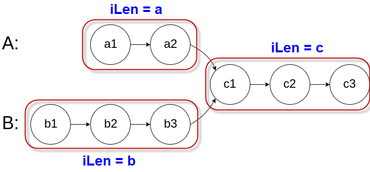

# 160.相交链表

## 解法一：双指针
* 算法思路：示意图如下。即 `a + c + b == b + c + a`

* 算法步骤
    * 创建链表A和链表B的哨兵节点 `pA` 和 `pB` ，然后向后逐个节点开始遍历
    * 当 `pA` 到达链表尾部时，将它重新初始化为链表B的头结点；同理，当 `pB` 到达链表尾部时，将它初始化为链表A的头结点
    * 在某一时刻，`pA` 和 `pB` 相遇的节点即为两个链表的相交节点
* 时间复杂度 O(n)
* 空间复杂度 O(1)

## 解法二：
* 算法思路
> 既然两个链表不相等，则先移动长链表的 `next` 指针，直到长链表的剩余部分和短链表长度相等，然后逐个比较两个链表的节点。找到相等的节点并返回

* 算法步骤
    * 分别计算两个链表的长度 `iSizeA` 和 `iSizeB`
    * 比较两个链表的长度，计算出长链表需要移动的次数 `n = iSizeA - iSizeB`
    * 移动长链表的 `next` 指针 `n` 次
    * 依次比较长链表的剩余部分节点和短链表的每个节点是否相等
    * 找到相等的节点并返回