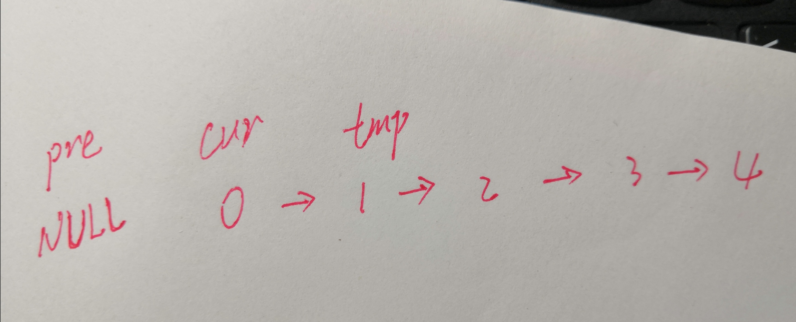
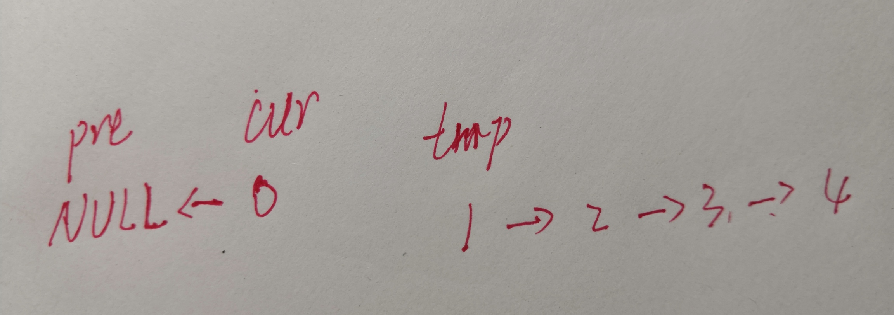
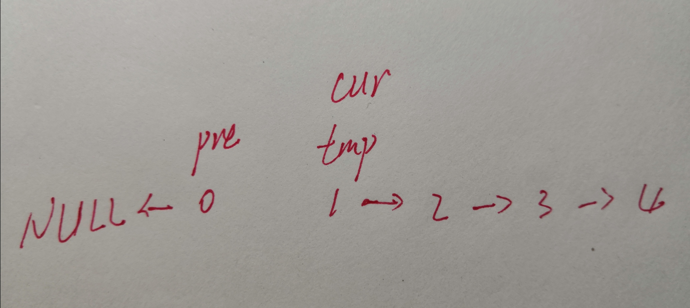

## 解题思路

### 思路一：迭代
* 将整个链表的指针指向翻转，即将当前节点的next指针指向前一个元素。由于没有保存当前节点的下一个节点，所以先要保存当前节点的下一个节点。然后逐个移动当前节点，使得每一个节点的指针都指向前一个元素

#### 样例：实现`0->1->2->3->4`链表的翻转
* 输出链表：`0<-1<-2<-3<-4`
* 解决思路：采用**迭代**的思路逐个翻转每个节点的指针指向
* 实现步骤
	* 说明：定义一个结点pre，并初始化为NULL。当前节点为cur
	* 翻转第一个节点0的指针指向：cur->next = pre
	> 如果第一步直接翻转当前节点的指针指向，则原链表中当前节点的下一个节点会丢失，所以必须先存储当前节点的下一个节点，然后再翻转当前节点的指针指向
	* 定义一个临时节点，用于保存当前节点的下一个节点。此时的链表结构如下图：
	
	* 执行节点翻转代码之后，链表变成了如下结构
	```
	ListNode *tmp = cur->next;
	cur->next = pre;
	```
	

	* 接下来，我们只需要移动pre节点和cur节点，然后翻转cur节点的指针指向。此时的链表结构如下：
	```
	pre = cur;
	cur = tmp;
	```
	
	* 最后，返回pre节点即可
